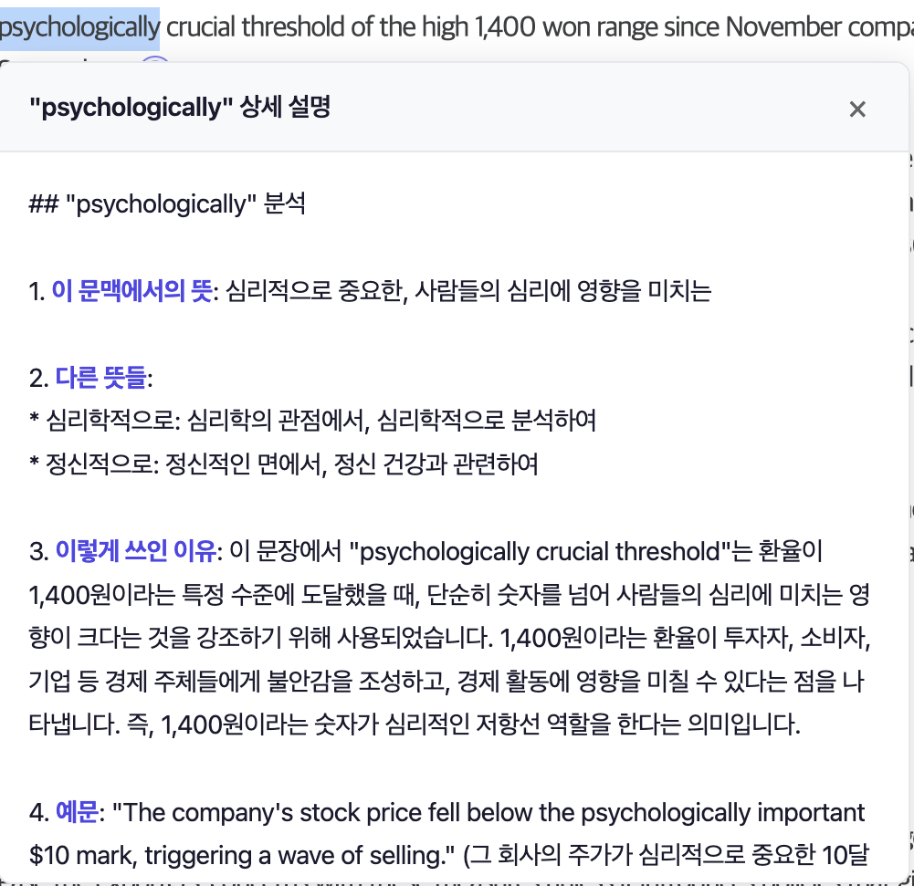
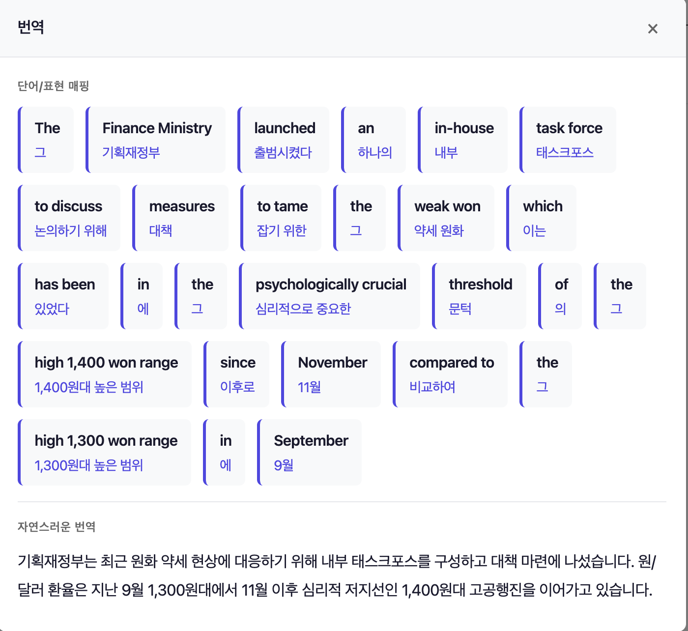
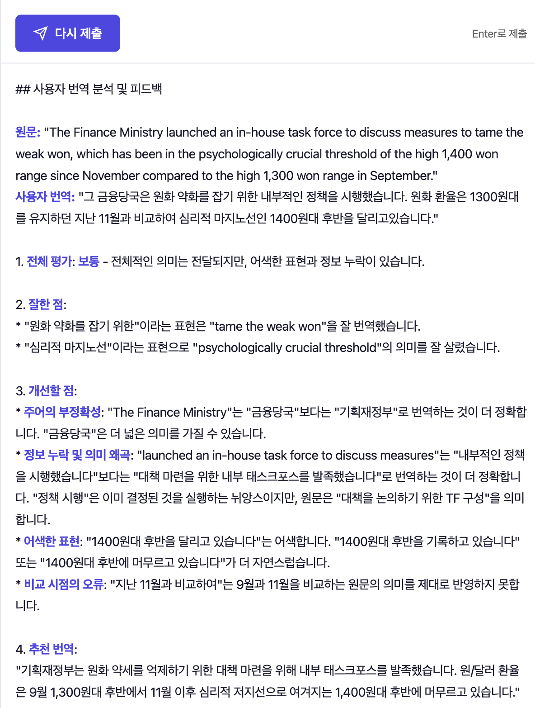

# LetMeKnow

영어 아티클을 읽으며 영어 실력을 키우는 Chrome 확장 프로그램

## 주요 기능

### 1. 단어/표현 즉시 번역
영어 단어를 드래그하면 해당 문단의 청크(의미 단위) 번역이 즉시 표시됩니다.
- 같은 문단 내 다른 단어 클릭 시 캐시된 번역 즉시 표시
- "자세히 보기"로 맥락 기반 상세 설명 확인

<details>
<summary>📸 스크린샷 보기</summary>




</details>

### 2. 문단 번역 보기
문단 끝 아이콘 클릭 → "번역 보기"
- **단어/표현 매핑**: 영어-한국어 청크 단위 대응
- **자연스러운 번역**: 전체 문단의 자연스러운 의역

<details>
<summary>📸 스크린샷 보기</summary>



</details>

### 3. 번역 연습 모드
문단 끝 아이콘 클릭 → "번역 해보기"
- 직접 번역을 입력하고 AI 피드백 받기
- 문법, 어색한 표현, 개선점 상세 분석

<details>
<summary>📸 스크린샷 보기</summary>



</details>

## 설치 방법

### A. 릴리즈 다운로드 (권장)

1. [Releases](https://github.com/NEWBIE0413/LetMeKnow/releases) 페이지에서 최신 버전의 `LetMeKnow-v*.zip` 다운로드
2. 압축 해제
3. Chrome 브라우저에서 `chrome://extensions` 접속
4. 우측 상단 **"개발자 모드"** 활성화
5. **"압축해제된 확장 프로그램을 로드합니다"** 클릭
6. 압축 해제한 폴더 선택

### B. 소스 코드에서 설치 (개발자용)

1. 저장소 클론
```bash
git clone https://github.com/NEWBIE0413/LetMeKnow.git
```
2. Chrome 브라우저에서 `chrome://extensions` 접속
3. 우측 상단 **"개발자 모드"** 활성화
4. **"압축해제된 확장 프로그램을 로드합니다"** 클릭
5. 클론한 `LetMeKnow` 폴더 선택

### API 키 설정
1. [OpenRouter](https://openrouter.ai/keys)에서 API 키 발급
2. Chrome 툴바의 LetMeKnow 아이콘 클릭
3. API 키 입력 후 저장

## 사용 방법

1. 영어 기사/아티클 페이지 접속
2. **단어 번역**: 알고 싶은 단어를 드래그
3. **문단 번역**: 문단 끝 아이콘(⏱) 클릭 → 번역 보기
4. **번역 연습**: 문단 끝 아이콘 클릭 → 번역 해보기

## 기술 스택

- Chrome Extension Manifest V3
- OpenRouter API (Google Gemini 2.0 Flash)
- Vanilla JavaScript

## 파일 구조

```
LetMeKnow/
├── manifest.json           # 확장 프로그램 설정
├── background/
│   └── background.js       # API 호출 (Service Worker)
├── content/
│   ├── content.js          # 메인 초기화
│   ├── selectionHandler.js # 텍스트 선택 감지
│   ├── sentenceDetector.js # 문단 감지
│   ├── translationUI.js    # 번역 팝업 UI
│   └── practiceMode.js     # 번역 연습 모드
├── popup/
│   ├── popup.html          # 설정 팝업
│   ├── popup.js
│   └── popup.css
├── styles/
│   └── content.css         # 주입 스타일
└── utils/
    └── cache.js            # 번역 캐시
```

## 라이선스

MIT License
